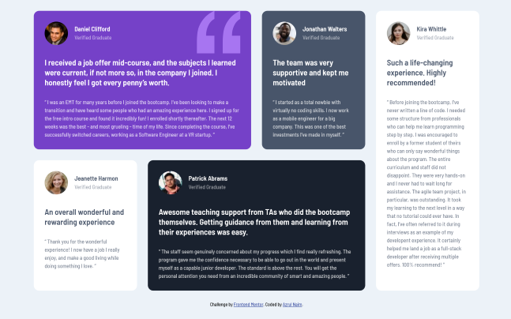

# Frontend Mentor - Testimonials grid section solution

This is a solution to the [Testimonials grid section challenge on Frontend Mentor](https://www.frontendmentor.io/challenges/testimonials-grid-section-Nnw6J7Un7). Frontend Mentor challenges help you improve your coding skills by building realistic projects. 

## Table of contents

- [Overview](#overview)
  - [The challenge](#the-challenge)
  - [Screenshot](#screenshot)
  - [Links](#links)
- [My process](#my-process)
  - [Built with](#built-with)
  - [What I learned](#what-i-learned)
  - [Continued development](#continued-development)
- [Author](#author)


## Overview

### The challenge

Users should be able to:

- View the optimal layout for the site depending on their device's screen size

### Screenshot

#### Mobile


#### Desktop



### Links

- Solution URL: [Add solution URL here](https://your-solution-url.com)
- Live Site URL: [Add live site URL here](https://your-live-site-url.com)

## My process

### Built with

- Semantic HTML5 markup
- CSS custom properties
- CSS Grid
- Mobile-first workflow

### What I learned

```css
@media only screen and (min-width: 768px) {
  .testimonials-list {
    grid-template-areas: 'testimony-1 testimony-1 testimony-2 testimony-5'
      'testimony-3 testimony-4 testimony-4 testimony-5';
    grid-template-rows: 50%;
    grid-template-columns: repeat(4, 1fr);
  }

  .testimony-1 {
    grid-area: testimony-1;
  }

  .testimony-2 {
    grid-area: testimony-2;
  }

  .testimony-3 {
    grid-area: testimony-3;
  }

  .testimony-4 {
    grid-area: testimony-4;
  }

  .testimony-5 {
    grid-area: testimony-5;
  }
}
```

### Continued development

css grid

## Author

- Website - [Azrul Naim](https://www.sjtape.github.io)
- Frontend Mentor - [@sjtape](https://www.frontendmentor.io/profile/sjtape)
- Twitter - [@solitaryjester](https://www.twitter.com/solitaryjester)